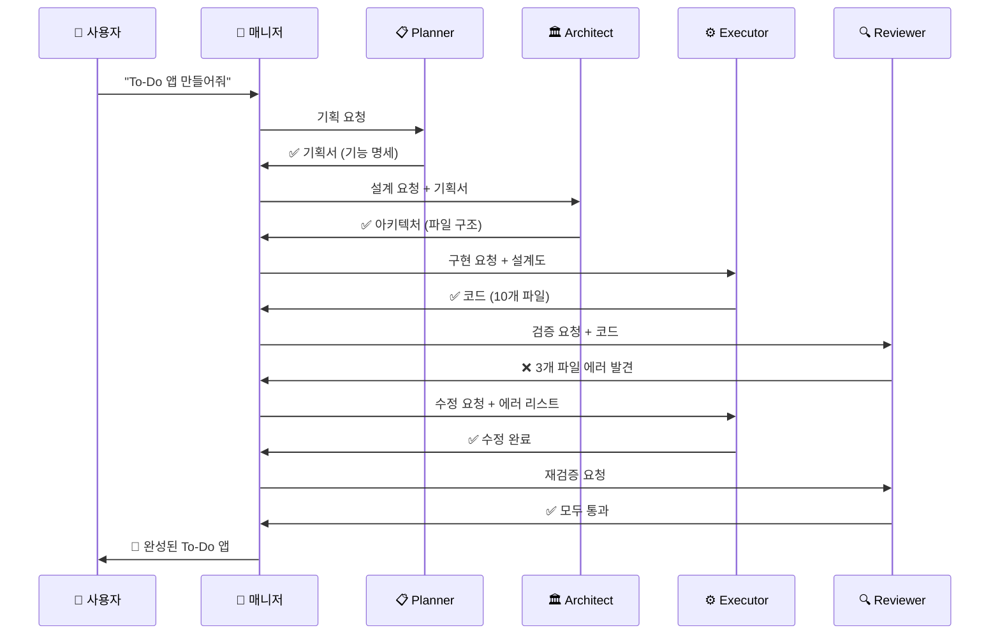

### 🔄 실제 작동 시퀀스 예시

```mermaid
sequenceDiagram
    participant U as 👤 사용자
    participant M as 🎯 매니저
    participant P as 📋 Planner
    participant A as 🏛️ Architect
    participant E as ⚙️ Executor
    participant R as 🔍 Reviewer

    U->>M: "To-Do 앱 만들어줘"

    M->>P: 기획 요청
    P->>M: ✅ 기획서 (기능 명세)

    M->>A: 설계 요청 + 기획서
    A->>M: ✅ 아키텍처 (파일 구조)

    M->>E: 구현 요청 + 설계도
    E->>M: ✅ 코드 (10개 파일)

    M->>R: 검증 요청 + 코드
    R->>M: ❌ 3개 파일 에러 발견

    M->>E: 수정 요청 + 에러 리스트
    E->>M: ✅ 수정 완료

    M->>R: 재검증 요청
    R->>M: ✅ 모두 통과

    M->>U: 🎉 완성된 To-Do 앱
```

**시퀀스 읽는 법:**
- **실선 화살표 (→)**: 요청 (Request)
- **점선 화살표 (- -)**: 응답 (Response)
- **✅**: 성공
- **❌**: 실패 (재작업 필요)

---