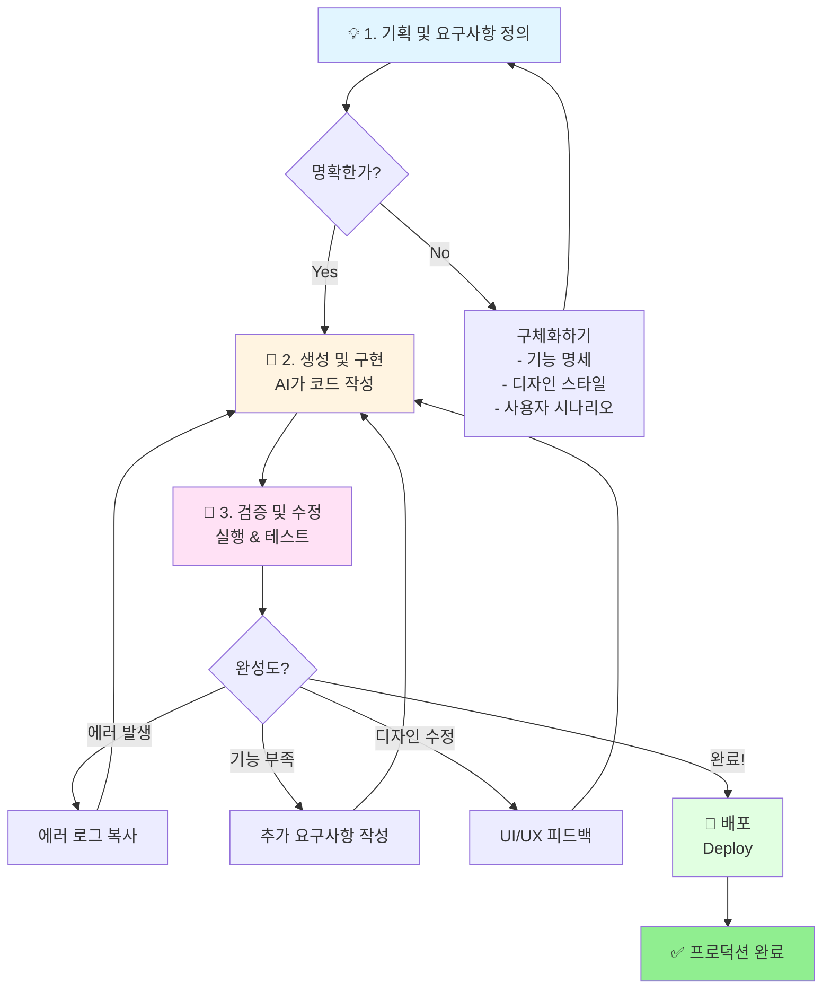

### 🔄 프로세스 플로우 다이어그램

**다이어그램 읽는 법:**
- 🔷 **파란색**: 기획 단계 (사람의 역할)
- 🔶 **주황색**: 구현 단계 (AI의 역할)
- 🔸 **분홍색**: 검증 단계 (사람 + AI 협업)
- 🟢 **초록색**: 완료 단계

**핵심 인사이트:**
1. **반복이 정상입니다** - 한 번에 완성되는 프로젝트는 없습니다
2. **에러는 진행의 증거** - 에러가 나온다는 것은 AI가 뭔가 시도했다는 의미
3. **대화가 곧 개발** - AI와의 채팅 기록이 바로 개발 문서가 됩니다

---