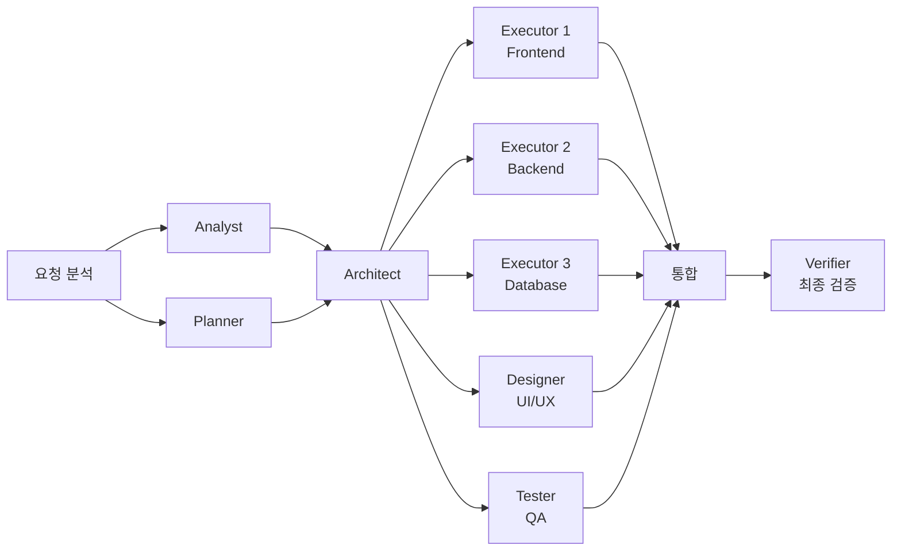

**목표**: E-커머스 사이트를 5개 에이전트가 동시에 제작
**난이도**: ⭐⭐⭐ 고급
**준비물**: 오마이클로드 설치


---

## Step 1: 프로젝트 초기화

```bash
mkdir e-commerce
cd e-commerce
claude
```


---

## Step 2: Ultrawork 모드 활성화

```
/oh-my-claudecode:ultrawork "쇼핑몰 만들어줘"
```

**Claude가 자동으로:**



---

## Step 3: 상세 요구사항 제공

```
"쇼핑몰 상세 기획:

기능:
1. 상품 목록 (필터링, 정렬)
2. 상품 상세 페이지
3. 장바구니 (로컬스토리지)
4. 간단한 결제 폼 (실제 결제 X)
5. 관리자 페이지 (상품 추가/수정/삭제)

기술 스택:
- Next.js 14 (App Router)
- Tailwind CSS
- TypeScript
- Prisma + SQLite
- NextAuth (간단 인증)

디자인:
- 미니멀 모던
- 화이트 베이스 + 포인트 컬러 (블루)
- 모바일 우선 반응형"
```


---

## Step 4: 병렬 작업 모니터링

**📸 Ultrawork 실행 화면:**

```
┌─────────────────────────────────────────────────────┐
│ 🚀 ULTRAWORK MODE ACTIVATED                         │
├─────────────────────────────────────────────────────┤
│                                                     │
│ 📋 Analyst     [████████] 100% ✅ 기획 완료        │
│ 🏗️ Planner     [████████] 100% ✅ 계획 완료        │
│ 🏛️ Architect   [████████] 100% ✅ 설계 완료        │
│                                                     │
│ ⚙️ Executor-1  [████▌   ] 65%  ⏳ Frontend 작업중  │
│ ⚙️ Executor-2  [██████  ] 75%  ⏳ API 구현중       │
│ ⚙️ Executor-3  [████████] 100% ✅ DB 스키마 완료   │
│ 🎨 Designer    [███████▌] 90%  ⏳ UI 컴포넌트      │
│ 🧪 Tester      [██      ] 25%  ⏳ 테스트 대기       │
│                                                     │
│ 생성된 파일: 47개 | 코드 라인: 3,247줄            │
│ 예상 완료: 8분 32초                                 │
└─────────────────────────────────────────────────────┘
```

**실시간 로그:**
```
[14:23:45] Executor-1: ✅ Created components/ProductCard.tsx
[14:23:47] Executor-2: ✅ Implemented /api/products route
[14:23:49] Designer:   ✅ Styled cart page with Tailwind
[14:23:52] Executor-3: ✅ Migrated Prisma schema
[14:23:55] Tester:     🧪 Running integration tests...
```


---

## Step 5: 중간 개입 (필요시)

```
"Designer야, 상품 카드에 호버 효과 추가해줘"

"Executor-2야, API에 페이지네이션 추가 (limit: 20)"

"Tester야, 장바구니 테스트 우선으로 실행"
```


---

## Step 6: 최종 검증

```
# 모든 에이전트 완료 후
┌─────────────────────────────────────────┐
│ 🔍 Verifier 최종 검증 중...             │
├─────────────────────────────────────────┤
│ ✅ 타입 체크 통과                       │
│ ✅ 빌드 성공                            │
│ ✅ 테스트 24/24 통과                    │
│ ✅ 보안 스캔 이상 없음                  │
│ ✅ 접근성 AAA 등급                      │
│                                         │
│ 🎉 프로젝트 완료!                       │
│ 📦 47 files, 3,247 lines               │
│ ⏱️  소요 시간: 12분 18초                │
└─────────────────────────────────────────┘
```


---

## Step 7: 실행 및 확인

```bash
npm install
npm run dev
# localhost:3000 접속
```

**🎉 완성된 쇼핑몰 확인!**

**학습 포인트:**
- ✅ **병렬 처리**: 5개 에이전트가 동시 작업 (5배 빠름)
- ✅ **역할 분담**: 각 에이전트가 전문 분야 담당
- ✅ **실시간 조율**: 중간에 방향 수정 가능
- ✅ **품질 보증**: Verifier가 최종 검증

**Ultrawork vs 일반 모드 비교:**

| 항목 | 일반 모드 | Ultrawork 모드 |
|------|----------|---------------|
| **소요 시간** | 60-90분 | 12-15분 |
| **에이전트 수** | 1개 | 5-8개 |
| **병렬 처리** | ❌ 순차 | ✅ 동시 |
| **품질 검증** | 수동 | 자동 (Verifier) |
| **컨텍스트 관리** | 수동 (/compact) | 자동 분산 |

---